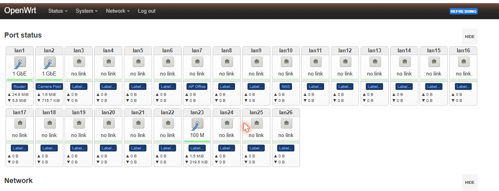
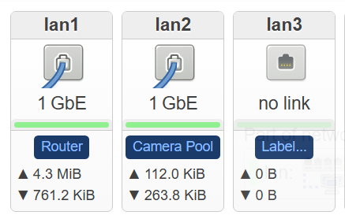
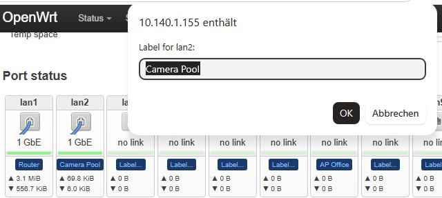

# Port Labels for LuCI

Dynamic, per-port labels on the LuCI **Status → Overview** page for OpenWrt
switches. Each port tile gets a small clickable badge; click it, type a name
like `Router`, `Camera Pool` or `NAS`, and it is stored on the switch and shown
to every browser on the network.

Developed and tested on **Zyxel GS1900-24HP** (v1/A1 and B1, `realtek/rtl838x`)
running **OpenWrt 24.10.x and 25.12.x**.



*Live LuCI Status → Overview on a GS1900-24HP: ports 1, 2, 7 and 10 are named
(`Router`, `Camera Pool`, `AP Office`, `NAS`); the rest show the `Label...`
placeholder.*

The blue badge sits **above the traffic counters**, directly under the link
speed.



## How it looks / how you edit

Click a badge and a small dialog asks for the text. Leave it empty to clear the
label. The change is saved immediately (no "Save & Apply" needed) and survives
page reloads and reboots.



*The prompt text (`Label for lanX:`) comes from the tool; the surrounding
dialog chrome is in your browser's own language.*

## Requirements

| Component | Needed for | Notes |
|-----------|-----------|-------|
| `uhttpd` + LuCI | the UI | present on any LuCI install |
| `jsonfilter` | CGI POST parsing | part of base OpenWrt |
| `python3-light` | **optional** | only if you let `install.sh` patch on-router without the awk fallback |

> **No Python required.** The CGI backend is pure shell/awk, and `install.sh`
> patches the view with an awk fallback when `python3` is missing (the default
> on OpenWrt 25.12).

## Files

| File | Destination on switch | Purpose |
|------|----------------------|---------|
| `port-labels.sh` | `/www/cgi-bin/port-labels.sh` | CGI backend – GET returns `{"labels":{…}}`, POST stores one label |
| `99_portlabels.js` | `/www/luci-static/resources/view/status/include/99_portlabels.js` | LuCI include – keeps badges in sync on every refresh |
| `port_labels.json` | `/usr/share/rpcd/acl.d/port_labels.json` | rpcd ACL |
| `badge_snippet.js` | *(used by installer only)* | literal badge markup for the awk patch |
| `patch_29ports.py` | *(run locally or on-router)* | inserts the badge into `29_ports.js` |
| `install.sh` | *(run on switch)* | does all of the above |

## Installation

Copy the folder to the switch and run the installer:

```sh
# from the folder that contains these files, on your PC:
scp -O -r files/* root@<switch-ip>:/tmp/portlabels/
ssh root@<switch-ip> "cd /tmp/portlabels && sh install.sh"
```

Then open **Status → Overview** in LuCI and press **Ctrl+Shift+R**. Click any
blue badge to name the port.

### Flaky link? Install step by step

The installer is idempotent — if the SSH connection drops midway, just run it
again; existing labels are never overwritten.

## Two things the original version got wrong

This repo fixes two bugs that were present in an earlier build of this tool:

1. **`patch_29ports.py` bracketing.** The badge insertion closed its brackets
   as `)])],` which produces
   `SyntaxError: missing ) after argument list` and blanks the whole Status
   page. The correct closure is `))]),` — see the comment in
   [`files/patch_29ports.py`](files/patch_29ports.py).

2. **CGI response shape.** The `GET` handler must return
   `{"labels": { … }}`, because `99_portlabels.js` reads `data.labels`. If it
   returns the bare object, the loader gets nothing on every LuCI poll and the
   labels **flicker and disappear a few seconds after each edit**.

## Behaviour across updates

| Item | Survives `sysupgrade` (config kept)? |
|------|--------------------------------------|
| `/etc/config/port_labels` (your labels) | ✅ yes |
| App files + `29_ports.js` patch | ❌ no — rerun `install.sh` |

Back up your labels before a **clean** flash (`sysupgrade -n`):

```sh
scp -O root@<switch-ip>:/etc/config/port_labels ./port_labels.backup
```

## Note on `29_ports.js`

`29_ports.js` is **device- and version-specific**. Always patch the file that
is already on the target switch — do **not** copy a patched one from another
box. It differs between LuCI 24.10 and 25.12, and was even observed to differ
between two switches on the *same* 25.12.5 release. `install.sh` and
`patch_29ports.py` both patch in place and keep a `.orig` backup.

## How it works

- **`port-labels.sh`** is a CGI served by `uhttpd`. `GET` walks
  `uci show port_labels` and emits `{"labels":{"lan1":"Router",…}}`. `POST`
  with `{"port":"lanN","text":"…"}` sets `port_labels.@label[x].text` and
  `uci commit`s it.
- **`29_ports.js` patch** injects a `.pl-wrap` badge into every port tile,
  positioned above the traffic counters. Clicking it runs `prompt()` and
  `POST`s the new text.
- **`99_portlabels.js`** loads all labels once, then a `MutationObserver`
  re-applies them whenever LuCI redraws the port grid (every few seconds),
  which is what keeps them visible.

## License

GPL-2.0-or-later (same as the LuCI code it extends).
